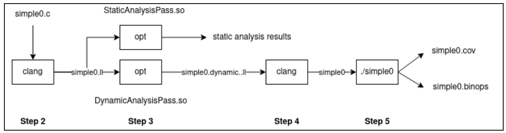

## Objective

In this lab, you will gain hands-on experience with the LLVM compiler framework through three interconnected objectives. First, you'll learn to read and write LLVM IR, the intermediate representation that serves as the foundation for program analysis and transformation in LLVM. Second, you'll use the LLVM API to write passes that analyze and modify programs, giving you practical experience with the tools used in modern compiler development. Finally, you'll explore the fundamental differences between static and dynamic program analysis by implementing both types of analyses for the same program properties.

## Pre-Requisites

Before starting this lab, you must read the [LLVM Primer][llvm-primer]. Part I provides an overview of the LLVM framework, while Part II explains the structure of LLVM IR - both are essential for completing the first part of this lab. Keep Part III (The LLVM API) readily available as a reference guide for the API calls you'll use throughout the lab. This primer will also be valuable for debugging and understanding LLVM IR in future labs.

## Setup

Begin by opening the lab2 folder in VS Code. You can do this either through the VS Code interface using 'Open Folder' or via the terminal:

```bash
code <lab2 directory>
```

Make sure Docker is running on your machine, then open the VS Code [Command Palette][command-palette] and search for "Reopen in Container". Select this option to set up the development environment. The skeleton code for Lab 2 will be located under `/lab2` in the container environment.

Once your environment is ready, build the initial project structure:

```bash
cd /lab2
mkdir -p build && cd build
cmake ..
make
```

This build process creates several important files in the `/lab2/build` directory. You'll see two LLVM passes: `StaticAnalysisPass.so` and `DynamicAnalysisPass.so`, which you'll be modifying throughout this lab. The build also produces `libruntime.so`, a runtime library that provides functions used for dynamic instrumentation.

## Part 1: Understanding the LLVM IR

**Task:** Write C programs that generate specific LLVM IR patterns by reverse-engineering provided LLVM IR files.

### Step 1: Exploring LLVM IR Generation

The LLVM IR is a low-level representation that sits between high-level source code and machine code. To understand how C programs translate to LLVM IR, you'll use clang to compile sample programs. Navigate to the test directory and try generating LLVM IR:

```bash
cd /lab2/test
clang -emit-llvm -S -fno-discard-value-names -c simple0.c
```

This command uses several important flags. The `-S` flag instructs clang to perform only preprocessing and compilation steps, while `-emit-llvm` generates LLVM IR instead of assembly code. The output is saved to `simple0.ll`. The `-fno-discard-value-names` flag is particularly useful for learning, as it preserves variable names in the generated LLVM IR, making it much more readable.

Take time to examine the generated `simple0.ll` file and compare it with the original C code. Notice how C constructs map to LLVM instructions, how types are represented, and how control flow is handled.

### Step 2: Reverse Engineering LLVM IR

To deepen your understanding of LLVM IR, you'll now work in reverse - writing C programs that generate specific LLVM IR. The `/lab2/ir_programs` directory contains several LLVM IR files, and your task is to write corresponding C programs in the `/lab2/c_programs` directory.

```bash
cd /lab2/c_programs
clang -emit-llvm -S -fno-discard-value-names -c test1.c
diff test1.ll ../ir_programs/test1.ll
```

The diff command will show any differences between your generated IR and the target IR. Your goal is to have no differences. For convenience, the Makefile automates this process:

```bash
make test1
```

This exercise requires careful attention to detail. Small differences in C code can produce different LLVM IR, so you'll need to match the exact structure of the target IR files. This hands-on experience will prove invaluable when debugging LLVM passes later in the course.

## Part 2: Understanding the LLVM API

**Task:** Implement static and dynamic analysis passes using the LLVM API to detect and analyze binary operators in programs.

### Step 1: Build System Setup

This lab uses CMake, a modern build system generator that's widely used in C++ projects. If you're unfamiliar with CMake, consider reading the [CMake tutorial][cmake-tutorial], particularly Steps 1 and 2. CMake generates a Makefile that you can use for subsequent builds. After modifying source files, you need only run `make` to rebuild your project - there's no need to run cmake again unless you modify the CMakeLists.txt file.

The workflow for this part of the lab follows the diagram below, moving from left to right through compilation, analysis, instrumentation, and execution phases:



### Step 2: Compiling to LLVM IR with Debug Information

The LLVM passes you'll implement operate on LLVM IR, so you must first compile C programs to this intermediate form. Additionally, you'll need debug information to map LLVM instructions back to source code locations:

```bash
cd /lab2/test
clang -emit-llvm -S -fno-discard-value-names -c -o simple0.ll simple0.c -g
```

The `-g` flag is crucial here - it includes debug information that your passes will use to report line and column numbers from the original C source.

### Step 3: Running the Static Analysis Pass

The static analysis pass examines the program without executing it. Run the provided skeleton pass using the opt tool:

```bash
opt -load-pass-plugin=../build/StaticAnalysisPass.so -passes="StaticAnalysisPass" -S simple0.ll -o simple0.static.ll
```

The `opt` tool is LLVM's optimizer and analyzer. The `-load-pass-plugin` option loads your pass library, while `-passes="StaticAnalysisPass"` specifies which pass to run. The current skeleton implementation reports the location of all instructions. After you complete your implementation, it will also identify and report binary operators. For now, the output program `simple0.static.ll` should be identical to the input, as this pass only analyzes without modifying the code.

### Step 4: Running the Dynamic Analysis Pass

The dynamic analysis pass instruments the program to collect runtime information:

```bash
opt -load-pass-plugin=../build/DynamicAnalysisPass.so -passes="DynamicAnalysisPass" -S simple0.ll -o simple0.dynamic.ll
```

Unlike the static pass, this creates a modified program in `simple0.dynamic.ll`. The skeleton implementation adds calls to track instruction coverage. You can verify the modifications using diff:

```bash
diff simple0.dynamic.ll simple0.ll
```

### Step 5: Creating and Running the Instrumented Executable

To see the dynamic analysis in action, compile the instrumented program and link it with the runtime library:

```bash
clang -o simple0 -L../build -lruntime simple0.dynamic.ll
./simple0
```

When you run the instrumented program, it creates output files tracking execution. The skeleton generates `simple0.cov` with coverage information. After you complete the implementation, it will also generate `simple0.binops` with binary operator execution data.

### Lab Instructions

#### Static Analysis Implementation

Your first task is to extend `src/StaticAnalysisPass.cpp` to identify and report binary operators. The skeleton code already iterates through all instructions and reports their locations. Study this code carefully to understand how the LLVM API works - notice how it traverses functions and instructions, and how it extracts debug information.

Within the instruction iteration loop (around line 34), you need to detect binary operators and print information about them. A binary operator in LLVM represents operations like addition, subtraction, multiplication, and division. To check if an instruction is a binary operator, use LLVM's dynamic casting:

```cpp
if (BinaryOperator *BinOp = dyn_cast<BinaryOperator>(&Inst)) {
    // This instruction is a binary operator
}
```

For each binary operator, print its type, location, and operands in this exact format:

```
Division on Line 4, Column 13 with first operand %0 and second operand %1
```

The `Utils.h` file provides helpful functions for this task. The `getBinOpSymbol` function returns a character representing the operator (like '/' for division), while `getBinOpName` converts this to a readable string (like "Division"). The `variable` function extracts the name of an operand from its LLVM Value representation. You can access the operands of a binary operator using `getOperand(0)` for the first operand and `getOperand(1)` for the second.

After completing your implementation, the output for `simple0.c` should include both the instruction locations (already provided) and your binary operator analysis:

```
Running Static Analysis Pass on function main
Locating Instructions
2, 7
2, 7
3, 7
3, 7
4, 7
4, 11
4, 15
4, 13
Division on Line 4, Column 13 with first operand %0 and second operand %1
4, 7
5, 3
```

Notice that multiple LLVM instructions can map to the same source location. This happens because a single line of C code often translates to multiple LLVM instructions.

#### Dynamic Analysis Implementation

The dynamic analysis task builds upon your static analysis by adding runtime instrumentation. You'll modify `src/DynamicAnalysisPass.cpp` to instrument binary operators so they report their execution at runtime.

The skeleton code already demonstrates instrumentation by injecting calls to `__coverage__` before each instruction. This function, defined in `lib/runtime.c`, records which lines of code execute. Study the `instrumentCoverage` function to understand how instrumentation works - it creates constant values for line and column numbers, builds an argument list, and inserts a function call.

Your task has two parts. First, in the main pass loop, detect binary operators (just as in the static pass) and call the `instrumentBinOpOperands` function.

Second, implement the `instrumentBinOpOperands` function. This function must inject calls to `__binop_op__`, which expects five arguments: the operator character, line number, column number, and the two operand values. A crucial insight for this implementation is that in LLVM, an instruction IS the variable it defines. When you see `%result = add i32 %a, %b` in LLVM IR, the add instruction itself represents `%result`. This means the operands of a binary operator can be passed directly as values to the instrumentation function.

Here's the structure of your implementation:

```cpp
void instrumentBinOpOperands(Module *M, BinaryOperator *BinOp, int Line, int Col) {
    // Get the context and types
    // ...
    
    // Create constant values for operator symbol, line, and column
    // Get the operands (remember: they ARE the values)
    // Build the argument vector
    // Insert the function call before the binary operator
}
```

After implementing both analyses, running the instrumented `simple0` program produces two files:

```
# simple0.cov
2, 7
2, 7
3, 7
3, 7
4, 7
4, 11
4, 15
4, 13
4, 7
5, 3

# simple0.binops
Division on Line 4, Column 13 with first operand=3 and second operand=2
```

#### Understanding Static and Dynamic Properties

This lab illustrates a fundamental distinction in program analysis. Static properties are those that can be determined by examining the code without running it - the presence of binary operators, their types, and their locations in the source code. Dynamic properties emerge only during execution - which operators actually run, in what order, and with what values.

Both types of analysis provide valuable insights. Static analysis can find all potential issues in code, while dynamic analysis reveals what actually happens during specific executions. In subsequent labs, you'll use both techniques to find bugs and generate test cases.

#### Important Notes and Tips

When implementing your passes, remember that not all LLVM instructions have debug information. Always check if debug information exists before using it. The skeleton code demonstrates this pattern.

If you encounter issues, add debugging output using `outs()` to understand what your pass is seeing:

```cpp
outs() << "Instruction: " << Inst << "\n";
```

Pay careful attention to the exact output format required, as the autograder will check for exact matches.

## Submission

After completing both parts of the lab, create your submission file:

```bash
cd /lab2
make submit
```

This creates a `submission.zip` file containing your implementations. Upload this file to Gradescope for grading.

[llvm-primer]: https://www.cis.upenn.edu/~cis5470/llvm.pdf
[llvm-lang]: https://llvm.org/docs/LangRef.html
[llvm-api]: https://releases.llvm.org/9.0.0/docs/index.html
[llvm-pass]: https://llvm.org/docs/WritingAnLLVMPass.html
[llvm]: https://llvm.org/
[command-palette]: https://code.visualstudio.com/docs/getstarted/tips-and-tricks#_command-palette
[clang-cli-opts]:https://releases.llvm.org/9.0.0/tools/clang/docs/UsersManual.html#command-line-options
[cmake-tutorial]: https://cmake.org/cmake/help/latest/guide/tutorial/index.html
[makefile-tutorial]: https://www.gnu.org/software/make/manual/html_node/Simple-Makefile.html#Simple-Makefile
[opt-doc]: https://releases.llvm.org/9.0.0/docs/CommandGuide/opt.html
[instrumentation-def]: https://en.wikipedia.org/wiki/Instrumentation_(computer_programming)
[llvm-insert-inst]: https://releases.llvm.org/9.0.0/docs/ProgrammersManual.html#creating-and-inserting-new-instructions
[llvm-insert-function]: https://llvm.org/doxygen/classllvm_1_1Module.html#a89b5f89041a0375f7ece431f29421bee
[callinst-create]: https://llvm.org/doxygen/classllvm_1_1CallInst.html#a850d8262cd900958b3153c4aa080b2bb